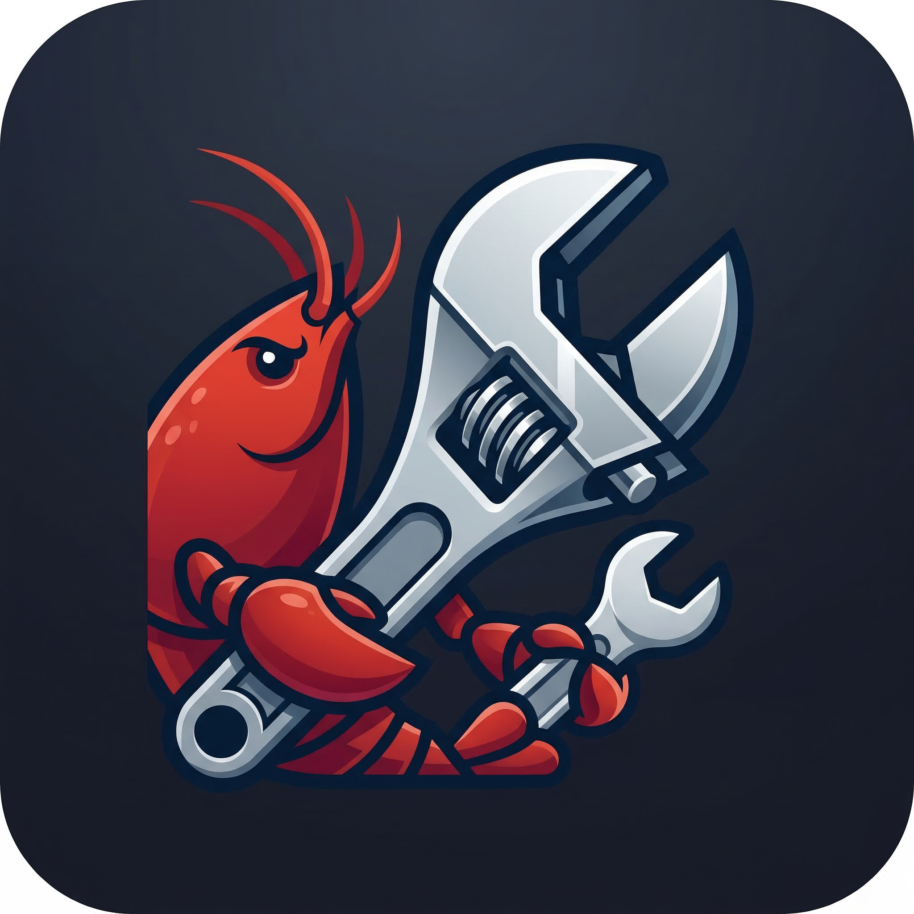

<p align="center">
  
</p>

<h1 align="center">Claw Tool</h1>

<p align="center">
  <strong>OpenClaw 图形化管理工具 / OpenClaw Desktop Manager</strong>
</p>

<p align="center">
  <a href="LICENSE"></a>
  
  
</p>

---

## 简介 / About

**Claw Tool** 是一款基于 NW.js + Vue 3 的跨平台桌面应用，为 [OpenClaw](https://github.com/openclaw/openclaw)（多通道 AI 网关）提供图形化的安装、配置和管理能力。无需命令行经验，即可完成 OpenClaw 的全生命周期管理。

**Claw Tool** is a cross-platform desktop application built with NW.js + Vue 3, providing a graphical interface for installing, configuring, and managing [OpenClaw](https://github.com/openclaw/openclaw) — a multi-channel AI gateway. No command-line experience required.

## 功能特性 / Features

### 一键安装 / One-Click Installation
- 自动检测 Node.js 和 npm 环境，缺失时引导一键安装
- 一键安装 OpenClaw，支持自定义 npm 镜像源
- Auto-detect Node.js/npm environment with guided installation
- One-click OpenClaw installation with custom registry support

### 可视化配置 / Visual Configuration
- 供应商管理：支持 OpenAI、Anthropic、Google Gemini、Ollama、AWS Bedrock 等
- 通道管理：Telegram、Discord、Slack、WhatsApp、飞书、LINE、Matrix 等
- 配置完成后可直接测试连通性
- Provider management: OpenAI, Anthropic, Google Gemini, Ollama, AWS Bedrock, etc.
- Channel management: Telegram, Discord, Slack, WhatsApp, Feishu, LINE, Matrix, etc.
- Test connectivity directly after configuration

### 服务管理 / Service Management
- 启动 / 停止 / 重启 OpenClaw Gateway
- Daemon 守护进程模式，支持开机自启
- 实时日志流查看
- Start / Stop / Restart OpenClaw Gateway
- Daemon mode with auto-start on boot
- Real-time log streaming

### 远程实例管理 / Remote Instance Management
- 通过 SSH 管理远程服务器上的 OpenClaw（密码或密钥认证）
- 全局实例切换，所有操作自动路由到对应实例
- 远程安装、配置、启停、测试、日志查看
- Manage remote OpenClaw instances via SSH (password or key authentication)
- Global instance switching — all operations route to the selected instance
- Remote installation, configuration, service control, testing, and log viewing

### 状态监控与测试 / Monitoring & Testing
- 仪表盘实时展示运行状态和健康检查
- 发送测试消息并以 Markdown 渲染返回结果
- 内置诊断工具（`openclaw doctor`）
- Real-time dashboard with health checks
- Send test messages with Markdown-rendered responses
- Built-in diagnostics (`openclaw doctor`)

### 系统托盘 / System Tray
- 最小化到系统托盘后台运行
- 托盘菜单快速启停 Gateway、切换通道
- Minimize to system tray for background operation
- Quick Gateway control and channel toggling from tray menu

### HTTP 远程测试 / Remote HTTP Testing
- 内嵌 HTTP 服务器，提供与桌面端相同的 Web UI
- Token 认证，安全访问
- 方便在无桌面环境下远程测试
- Embedded HTTP server serving the same Web UI
- Token-based authentication for secure access
- Convenient remote testing without desktop access

## 支持平台 / Supported Platforms

| 平台 / Platform | 架构 / Architecture |
|:---:|:---:|
| Windows | x64 (amd64), arm64 |
| macOS | arm64 (Apple Silicon) |

## 技术栈 / Tech Stack

| 层级 / Layer | 技术 / Technology |
|---|---|
| 桌面框架 / Desktop | NW.js |
| 前端 / Frontend | Vue 3 + Composition API |
| 构建工具 / Build | Vite 6 |
| UI 组件 / Components | Element Plus |
| 状态管理 / State | Pinia |
| HTTP 服务 / Server | Express |
| SSH 连接 / SSH | ssh2 |
| 配置解析 / Config | JSON5 |

## 快速开始 / Quick Start

```bash
# 克隆仓库 / Clone the repository
git clone --recursive https://github.com/touwaeriol/claw-tool.git
cd claw-tool

# 安装依赖 / Install dependencies
npm install

# 开发模式 / Development mode
npm run dev

# 构建生产版本 / Build for production
npm run build

# 打包桌面应用 / Package desktop app
npm run build:win-x64    # Windows x64
npm run build:win-arm64   # Windows arm64
npm run build:mac-arm64   # macOS Apple Silicon
npm run build:all         # All platforms
```

## 项目结构 / Project Structure

```
claw-tool/
├── src/
│   ├── main/              # NW.js 主进程 / Main process
│   │   ├── index.js       # 入口 / Entry
│   │   ├── installer.js   # 安装器 / Installer
│   │   ├── config-manager.js  # 配置管理 / Config manager
│   │   ├── process-manager.js # 进程管理 / Process manager
│   │   ├── daemon.js      # 守护进程 / Daemon
│   │   ├── monitor.js     # 状态监控 / Monitor
│   │   ├── channel-tester.js  # 通道测试 / Channel tester
│   │   ├── tray.js        # 系统托盘 / System tray
│   │   └── server.js      # HTTP 服务 / HTTP server
│   ├── renderer/          # Vue 3 渲染进程 / Renderer
│   │   ├── views/         # 页面视图 / Views
│   │   ├── components/    # 组件 / Components
│   │   ├── stores/        # Pinia 状态 / Stores
│   │   ├── router/        # 路由 / Router
│   │   └── styles/        # 样式 / Styles
│   ├── executor/          # 执行抽象层 / Executor abstraction
│   │   ├── local.js       # 本地执行器 / Local executor
│   │   ├── ssh.js         # SSH 执行器 / SSH executor
│   │   └── factory.js     # 工厂 / Factory
│   └── shared/            # 共享代码 / Shared
├── openclaw/              # OpenClaw 子模块 / Submodule
├── docs/                  # 文档 / Documentation
├── scripts/               # 构建脚本 / Build scripts
├── assets/                # 静态资源 / Assets
└── .github/workflows/     # CI/CD
```

## 许可证 / License

[MIT](LICENSE)

## 相关项目 / Related Projects

- [OpenClaw](https://github.com/openclaw/openclaw) — 多通道 AI 网关 / Multi-channel AI Gateway
